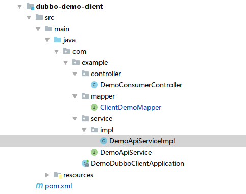

Dubbo 示例说明  
共三个模块如下：  
dubbo-demo-client(发起方 | LCN模式)     
dubbo-demo-d  (参与方 | TXC模式)  
dubbo-demo-e  (参与方 | TCC模式)  

代码地址:https://github.com/codingapi/txlcn-demo

调用关系说明:

dubbo-demo-client -> DemoConsumerController的`txlcn`的Mapping是调用发起方法，代码如下。
```java
@RestController
public class DemoConsumerController {


    @Autowired
    private DemoApiService demoApiService;


    @RequestMapping("/txlcn")
    public String sayHello(@RequestParam("value") String value) {
        return demoApiService.execute(value);
    }

}

```
DemoApiService.execute(value)方法代码:
```java
@Service
public class DemoApiServiceImpl implements DemoApiService {

    @Reference(version = "${demo.service.version}",
            application = "${dubbo.application.d}",
            registry = "${dubbo.registry.address}",
            retries = -1,
            check = false,
            loadbalance = "txlcn_random")
    private DDemoService dDemoService;

    @Reference(version = "${demo.service.version}",
            application = "${dubbo.application.e}",
            retries = -1,
            check = false,
            registry = "${dubbo.registry.address}",
            loadbalance = "txlcn_random")
    private EDemoService eDemoService;

    @Autowired
    private DemoMapper demoMapper;

    @Override
    @LcnTransaction
    public String execute(String name) {

        /*
         * 注意 5.0.0 请用 DTXLocal 类
         * 注意 5.0.0 请自行获取应用名称
         * 注意 5.0.0 其它类重新导入包名
         */
        String dResp = dDemoService.rpc(name);
        String eResp = eDemoService.rpc(name);
        Demo demo = new Demo();
        demo.setCreateTime(new Date());
        demo.setAppName(Transactions.APPLICATION_ID_WHEN_RUNNING);
        demo.setDemoField(name);
        demo.setGroupId(DTXLocalContext.getOrNew().getGroupId());
        demo.setUnitId(DTXLocalContext.getOrNew().getUnitId());
        demoMapper.save(demo);

//        int a = 1 / 0;
        return dResp + " > " + eResp + " > " + "client-ok";
    }
}


```
参与方dDemoService.rpc(name)的代码

```java
@Service(
        version = "${demo.service.version}",
        application = "${dubbo.application.id}",
        protocol = "${dubbo.protocol.id}",
        registry = "${dubbo.registry.id}"
)
@Slf4j
public class DefaultDemoService implements DDemoService {

    @Autowired
    private DDemoMapper demoMapper;

    @Override
    @TxTransaction(type = "txc")
    public String rpc(String name) {

        /*
         * 注意 5.0.0 请用 DTXLocal 类
         * 注意 5.0.0 请自行获取应用名称
         * 注意 5.0.0 其它类重新导入包名
         */
        log.info("GroupId: {}", TracingContext.tracing().groupId());
        Demo demo = new Demo();
        demo.setDemoField(name);
        demo.setCreateTime(new Date());
        demo.setGroupId(DTXLocalContext.getOrNew().getGroupId());
        demo.setAppName(Transactions.APPLICATION_ID_WHEN_RUNNING);
        demo.setUnitId(DTXLocalContext.getOrNew().getUnitId());
        demoMapper.save(demo);
        return "d-ok";
    }

}

```

参与方eDemoService.rpc(name)的代码
```java
@Service(
        version = "${demo.service.version}",
        application = "${dubbo.application.id}",
        protocol = "${dubbo.protocol.id}",
        registry = "${dubbo.registry.id}"
)
@Slf4j
public class DefaultDemoService implements EDemoService {

    @Autowired
    private EDemoMapper demoMapper;

    private ConcurrentHashMap<String, Long> ids = new ConcurrentHashMap<>();

    @Override
    @TccTransaction(confirmMethod = "cm", cancelMethod = "cl", executeClass = DefaultDemoService.class)
    public String rpc(String name) {
        /*
         * 注意 5.0.0 请用 DTXLocal 类
         * 注意 5.0.0 请自行获取应用名称
         * 注意 5.0.0 其它类重新导入包名
         */
        log.info("GroupId: {}", TracingContext.tracing().groupId());
        Demo demo = new Demo();
        demo.setDemoField(name);
        demo.setCreateTime(new Date());
        demo.setGroupId(DTXLocalContext.getOrNew().getGroupId());
        demo.setUnitId(DTXLocalContext.getOrNew().getUnitId());
        demo.setAppName(Transactions.APPLICATION_ID_WHEN_RUNNING);
        demoMapper.save(demo);
        ids.put(DTXLocalContext.cur().getGroupId(), demo.getId());
        return "e-ok";
    }

    public void cm(String name) {
        log.info("tcc-confirm-" + DTXLocalContext.getOrNew().getGroupId());
        ids.remove(DTXLocalContext.getOrNew().getGroupId());
    }

    public void cl(String name) {
        log.info("tcc-cancel-" + DTXLocalContext.getOrNew().getGroupId());
        demoMapper.deleteByKId(ids.get(DTXLocalContext.getOrNew().getGroupId()));
    }
}

```

## 事务参与方D配置
 工程截图  
      
项目配置文件 application.properties  
```properties
# Spring boot application
spring.application.name=dubbo-demo-d
server.port=12005
management.port=12008

# Service version
demo.service.version=1.0.0

# Base packages to scan Dubbo Components (e.g @Service , @Reference)
dubbo.scan.basePackages=com.example

# Dubbo Config properties
## ApplicationConfig Bean
dubbo.application.id=dubbo-demo-d
dubbo.application.name=dubbo-demo-d

## ProtocolConfig Bean
dubbo.protocol.id=dubbo
dubbo.protocol.name=dubbo
dubbo.protocol.port=12345

## RegistryConfig Bean
dubbo.registry.id=my-registry
dubbo.registry.address=127.0.0.1:2181
dubbo.registry.protocol=zookeeper
dubbo.application.qos.enable=false

## DB
spring.datasource.driver-class-name=com.mysql.jdbc.Driver
spring.datasource.url=jdbc:mysql://127.0.0.1:3306/txlcn-demo?characterEncoding=UTF-8&serverTimezone=UTC
spring.datasource.username=root
spring.datasource.password=root
spring.datasource.hikari.maximum-pool-size=20
mybatis.configuration.map-underscore-to-camel-case=true
mybatis.configuration.use-generated-keys=true

## tx-manager 配置
#tx-lcn.client.manager-address=127.0.0.1:8070
```
## Application代码

```java

@SpringBootApplication
@EnableDistributedTransaction
public class DemoDubboDApplication {

    public static void main(String[] args) {
        SpringApplication.run(DemoDubboDApplication.class, args);

    }

}

```

## 事务参与方 E
工程截图  
  
配置文件 application.properties  
```properties

# Spring boot application
spring.application.name=dubbo-demo-e
server.port=12006
management.port=12009

# Service version
demo.service.version=1.0.0

# Base packages to scan Dubbo Components (e.g @Service , @Reference)
dubbo.scan.basePackages=com.example

# Dubbo Config properties
## ApplicationConfig Bean
dubbo.application.id=dubbo-demo-e
dubbo.application.name=dubbo-demo-e

dubbo.application.service4=dubbo-demo-client

## ProtocolConfig Bean
dubbo.protocol.id=dubbo
dubbo.protocol.name=dubbo
dubbo.protocol.port=12346

## RegistryConfig Bean
dubbo.registry.id=my-registry
dubbo.registry.address=127.0.0.1:2181
dubbo.registry.protocol=zookeeper

dubbo.application.qos.enable=false

#db
spring.datasource.driver-class-name=com.mysql.jdbc.Driver
spring.datasource.url=jdbc:mysql://127.0.0.1:3306/txlcn-demo\
  ?characterEncoding=UTF-8&serverTimezone=UTC
spring.datasource.username=root
spring.datasource.password=root
spring.datasource.hikari.maximum-pool-size=20

mybatis.configuration.map-underscore-to-camel-case=true
mybatis.configuration.use-generated-keys=true

## tx-manager 配置
#tx-lcn.client.manager-address=127.0.0.1:8070

```
## Application代码

```java
@SpringBootApplication
@EnableDistributedTransaction
public class DemoDubboEApplication {

    public static void main(String[] args) {
        SpringApplication.run(DemoDubboEApplication.class, args);

    }

}

```

## 事务发起方 Client
  工程目录  
   
项目配置文件 application.properties  
```properties

# Spring boot application
spring.application.name=dubbo-demo-client
server.port=12004
management.port=12007

# Service Version
demo.service.version=1.0.0

# Dubbo Config properties
## ApplicationConfig Bean
dubbo.application.id=dubbo-demo-client
dubbo.application.name=dubbo-demo-client
dubbo.application.d=dubbo-demo-d
dubbo.application.e=dubbo-demo-e
## ProtocolConfig Bean
dubbo.protocol.id=dubbo
dubbo.protocol.name=dubbo
dubbo.protocol.port=12345
dubbo.registry.protocol=zookeeper
dubbo.registry.address=127.0.0.1:2181


spring.datasource.driver-class-name=com.mysql.jdbc.Driver
spring.datasource.url=jdbc:mysql://127.0.0.1:3306/txlcn-demo?characterEncoding=UTF-8&serverTimezone=UTC
spring.datasource.username=root
spring.datasource.password=root
spring.datasource.hikari.maximum-pool-size=20
mybatis.configuration.map-underscore-to-camel-case=true
mybatis.configuration.use-generated-keys=true

## 切面日志信息(h2数据库地址,自创建)
#tx-lcn.aspect.log.file-path=D://txlcn/h2-${spring.application.name}
#
## manager服务地址(rpc端口),可填写多个负载
#tx-lcn.client.manager-address=127.0.0.1:8070
#
## 开启日志数据库记录存储
#tx-lcn.logger.enabled=true
## 日志数据库存储jdbc配置
#tx-lcn.logger.driver-class-name=com.mysql.jdbc.Driver
#tx-lcn.logger.jdbc-url=jdbc:mysql://127.0.0.1:3306/tx-logger?characterEncoding=UTF-8&serverTimezone=UTC
#tx-lcn.logger.username=root
#tx-lcn.logger.password=123456

```

## 启动Dubbo微服务
 事务参与方 D  

 事务参与方 E  

 事务发起方 Client  


