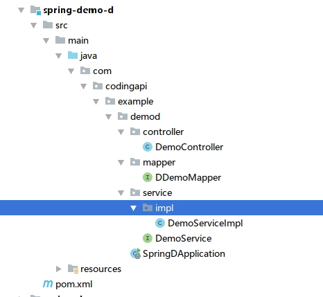
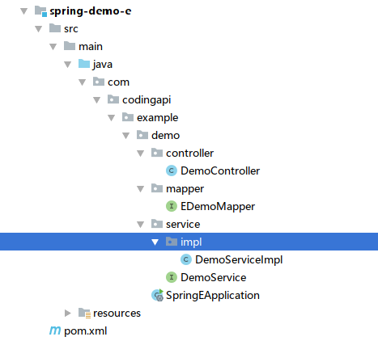

# SpringCloud示例

SpringCloud 示例说明  
共三个模块如下：  
spring-demo-client(发起方 | LCN模式)     
spring-demo-d  (参与方 | TXC模式)  
spring-demo-e  (参与方 | TCC模式)  

代码地址:https://github.com/codingapi/txlcn-demo

调用关系说明:

spring-demo-client -> DemoController的`txlcn`的Mapping是调用发起方法，代码如下。

```java
@RestController
public class DemoController {

    private final DemoService demoService;

    @Autowired
    public DemoController(DemoService demoService) {
        this.demoService = demoService;
    }

    @RequestMapping("/txlcn")
    public String execute(@RequestParam("value") String value) {
        return  demoService.execute(value);
    }


}


```

demoService.execute(value)代码:   
```java

@Service
@Slf4j
public class DemoServiceImpl implements DemoService {

    private final ClientDemoMapper demoMapper;

    private final DDemoClient dDemoClient;

    private final EDemoClient eDemoClient;

    @Autowired
    public DemoServiceImpl(ClientDemoMapper demoMapper, DDemoClient dDemoClient, EDemoClient eDemoClient) {
        this.demoMapper = demoMapper;
        this.dDemoClient = dDemoClient;
        this.eDemoClient = eDemoClient;
    }

    @Override
    @LcnTransaction
    public String execute(String value) {
        /*
         * 注意 5.0.0 请用 DTXLocal 类
         * 注意 5.0.0 请自行获取应用名称
         * 注意 5.0.0 其它类重新导入包名
         */

        // ServiceD
        String dResp = dDemoClient.rpc(value);

        // ServiceE
        String eResp = eDemoClient.rpc(value);

        // local transaction
        Demo demo = new Demo();
        demo.setDemoField(value);
        demo.setAppName(Transactions.APPLICATION_ID_WHEN_RUNNING); // 应用名称
        demo.setCreateTime(new Date());
        demo.setGroupId(DTXLocalContext.getOrNew().getGroupId());  // DTXLocal
        demo.setUnitId(DTXLocalContext.getOrNew().getUnitId());
        demoMapper.save(demo);

        // 手动异常，DTX B回滚
//        int i = 1 / 0;
        return dResp + " > " + eResp + " > " + "ok-client";
    }
}
```

 dDemoClient.rpc(value)代码:
 
 ```java
@Service
@Slf4j
public class DemoServiceImpl implements DemoService {

    private final DDemoMapper demoMapper;


    @Autowired
    public DemoServiceImpl(DDemoMapper demoMapper) {
        this.demoMapper = demoMapper;
    }

    @Override
    @TxcTransaction(propagation = DTXPropagation.SUPPORTS)
    @Transactional
    public String rpc(String value) {
        /*
         * 注意 5.0.0 请用 DTXLocal 类
         * 注意 5.0.0 请自行获取应用名称
         * 注意 5.0.0 其它类重新导入包名
         */
//        log.info("GroupId: {}", TracingContext.tracing().groupId());
        Demo demo = new Demo();
        demo.setCreateTime(new Date());
        demo.setDemoField(value);
        demo.setAppName(Transactions.APPLICATION_ID_WHEN_RUNNING);  // 应用名称
        demo.setGroupId(DTXLocalContext.getOrNew().getGroupId());   // DTXLocal
        demo.setUnitId(DTXLocalContext.getOrNew().getUnitId());
        demoMapper.save(demo);
//        moreOperateMapper.update(new Date());
//        moreOperateMapper.delete();
        return "ok-d";
    }
}

```
 eDemoClient.rpc(value)代码：
 
```java
@Service
@Slf4j
public class DemoServiceImpl implements DemoService {

    private final EDemoMapper demoMapper;

    private ConcurrentHashMap<String, Long> ids = new ConcurrentHashMap<>();

    @Autowired
    public DemoServiceImpl(EDemoMapper demoMapper) {
        this.demoMapper = demoMapper;
    }

    @Override
    @TccTransaction(propagation = DTXPropagation.SUPPORTS)
    @Transactional
    public String rpc(String value) {
        /*
         * 注意 5.0.0 请用 DTXLocal 类
         * 注意 5.0.0 请自行获取应用名称
         * 注意 5.0.0 其它类重新导入包名
         */
//        log.info("GroupId: {}", TracingContext.tracing().groupId());

        Demo demo = new Demo();
        demo.setDemoField(value);
        demo.setCreateTime(new Date());
        demo.setAppName(Transactions.APPLICATION_ID_WHEN_RUNNING);
        demo.setGroupId(DTXLocalContext.getOrNew().getGroupId());
        demo.setUnitId(DTXLocalContext.getOrNew().getUnitId());
        demoMapper.save(demo);
//        ids.put(DTXLocalContext.getOrNew().getGroupId(), demo.getId());
        return "ok-e";
    }

    public void confirmRpc(String value) {
        log.info("tcc-confirm-" + DTXLocalContext.getOrNew().getGroupId());
        ids.remove(DTXLocalContext.getOrNew().getGroupId());
    }

    public void cancelRpc(String value) {
        log.info("tcc-cancel-" + DTXLocalContext.getOrNew().getGroupId());
        Long kid = ids.get(DTXLocalContext.getOrNew().getGroupId());
        demoMapper.deleteByKId(kid);
    }
}

```

## 事务参与方D
 工程截图  
     
项目配置文件 application.properties  
```properties

spring.application.name=spring-demo-d
server.port=12002
spring.datasource.type=com.alibaba.druid.pool.DruidDataSource
spring.datasource.driver-class-name=com.mysql.jdbc.Driver
## TODO 你的配置
spring.datasource.url=jdbc:mysql://127.0.0.1:3306/txlcn-demo\
  ?characterEncoding=UTF-8&serverTimezone=UTC
spring.datasource.username=root
spring.datasource.password=root
#spring.datasource.hikari.maximum-pool-size=20
mybatis.configuration.map-underscore-to-camel-case=true
mybatis.configuration.use-generated-keys=true


## tx-manager 配置
#tx-lcn.client.manager-address=127.0.0.1:8070

```

## Application

```java
@SpringBootApplication
@EnableDiscoveryClient
@EnableDistributedTransaction
public class SpringDApplication {

    public static void main(String[] args) {
        SpringApplication.run(SpringDApplication.class, args);

    }
}


```

## 事务参与方E
工程截图  
  
项目配置文件 application.properties  
```properties
spring.application.name=spring-demo-e
server.port=12003

spring.datasource.driver-class-name=com.mysql.jdbc.Driver
spring.datasource.url=jdbc:mysql://ip:port/txlcn-demo?characterEncoding=UTF-8
spring.datasource.username=root
spring.datasource.password=123456
spring.datasource.hikari.maximum-pool-size=20

mybatis.configuration.map-underscore-to-camel-case=true
mybatis.configuration.use-generated-keys=true

```
## Application

```java
@SpringBootApplication
@EnableDiscoveryClient
@EnableDistributedTransaction
public class SpringEApplication {

    public static void main(String[] args) {
        SpringApplication.run(SpringEApplication.class, args);
    }
}


```

## 事务发起方Client
工程截图   
  
项目配置文件 application.properties     
```properties
spring.application.name=spring-demo-client
server.port=12011
spring.datasource.driver-class-name=com.mysql.jdbc.Driver
## TODO 你的配置
spring.datasource.url=jdbc:mysql://127.0.0.1:3306/txlcn-demo?characterEncoding=UTF-8&serverTimezone=UTC
spring.datasource.username=root
spring.datasource.password=root
spring.datasource.hikari.maximum-pool-size=20
mybatis.configuration.map-underscore-to-camel-case=true
mybatis.configuration.use-generated-keys=true

# 关闭Ribbon的重试机制（如果有必要）
ribbon.MaxAutoRetriesNextServer=0
ribbon.ReadTimeout=5000
ribbon.ConnectTimeout=5000
        

## tx-manager 配置
#tx-lcn.client.manager-address=127.0.0.1:8070

```
## Application

```java
@SpringBootApplication
@EnableDiscoveryClient
@EnableDistributedTransaction
public class SpringClientApplication {

    public static void main(String[] args) {
        SpringApplication.run(SpringClientApplication.class, args);
    }
}

```

## 启动SpringCloud微服务
事务参与方 D  

事务参与方 E  

事务发起方 Client  

